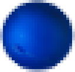
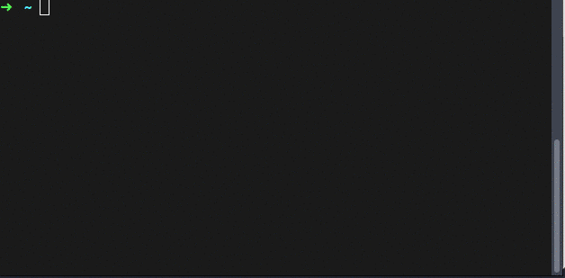

> Neptune is ScalaJS port of [pell](https://github.com/jaredreich/pell), the simplest and smallest WYSIWYG text editor for web, with no dependencies.



It's pure Scala; even the CSS is written in Scala using [ScalaCSS](https://github.com/japgolly/scalacss)



## Comparisons

| library       | size (min+gzip) | size (min) | jquery | bootstrap |
|---------------|-----------------|------------|--------|-----------|
| neptune       | 73kB            | 291kB      |        |           |
| pell          | 1.11kB          | 2.85kB     |        |           |
| medium-editor | 27kB            | 105kB      |        |           |
| quill         | 43kB            | 205kB      |        |           |
| ckeditor      | 163kB           | 551kB      |        |           |
| summernote    | 26kB            | 93kB       | x      | x         |
| froala        | 52kB            | 186kB      | x      |           |
| tinymce       | 157kB           | 491kB      | x      |           |

## Features

* Pure Scala, no dependencies
* Easily customizable with the Scala CSS DSL
* No separate CSS file, it's merged inside a single JS file and will be added to document automatically

Current actions:
- Bold
- Italic
- Underline
- Strike-through
- Heading 1
- Heading 2
- Paragraph
- Quote
- Ordered List
- Unordered List
- Code
- Horizontal Rule
- Link
- Image

## Browser Support

* IE 9+
* Chrome 5+
* Firefox 4+
* Safari 5+
* Opera 11.6+

## Compile

[Install SBT](http://www.scala-sbt.org/download.html) and then

```bash
sbt fullOptJS
```
Find the generated optimized JS file at: `target/scala-2.11/neptune-opt.js`


## License

MIT
